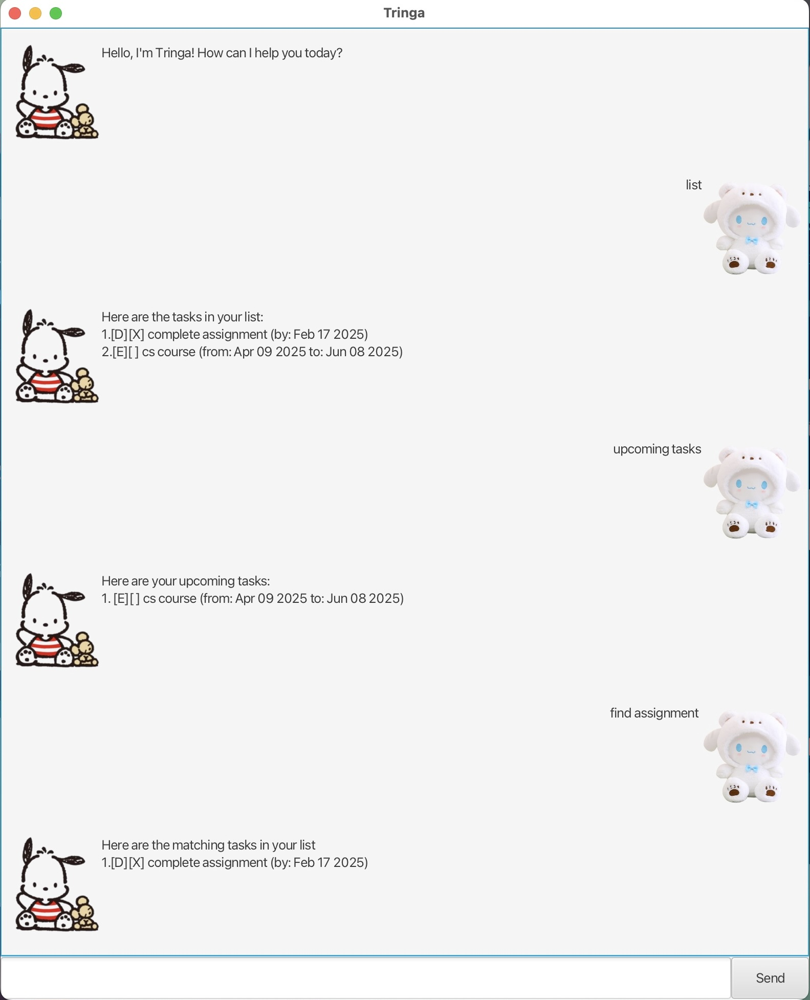

# Tringa User Guide




- [x] Do you have a **busy** schedule?
- [x] Do you want a **better** way to manage your schedule?

**Introducing...**  `Tringa`, a bot that _simplifies_ your task 
management journey and is _free_ for all to use!

## Feature Use Summary
1. _Find_ tasks with a keyword 
2. Add _todo_ tasks 
3. Add _deadline_ tasks (tasks with a deadline)
4. Add _event_ (tasks between a stipulated period)
5. _List_ task listings and completion status
6. _Mark_ tasks as done
7. _Delete_ unwanted tasks
8. View _upcoming tasks_ 

### Feature Format Summary 
1. find KEYWORD
2. todo DESCRIPTION
3. deadline DESCRIPTION /by DATE
4. event DESCRIPTION /from DATE /to DATE
5. list
6. mark INDEX
7. delete INDEX
8. upcoming tasks

# Feature Details
The sections below provide more detailed descriptions of each feature.

## Task Creation
`todo`
```
Users can add a todo task to the list in the format 
"todo DESCRIPTION" 

If the above format is not followed, the bot will prompt the user 
to add a todo task in the correct format.
```

`deadline`
```
Users can add a deadline task to the list in the format 
"deadline DESCRIPTION /by DATE"

If the above format is not followed, the bot will prompt the user 
to add a deadline task in the correct format.
```

`event`
```
Users can add an event task to the list in the format 
"event DESCRIPTION /from DATE /to DATE"

If the above format is not followed, the bot will prompt the user 
to add an event task in the correct format.
```
### Task Search 
`find`
```
Users can find a task from the list by searching in the format
"find KEYWORD" 

The bot will return all tasks in the current list that contain
the specified keyword. 

If there are no matching tasks found in the current list, the bot 
will output "No matching tasks found in current list."
```

### Task Deletion
`delete`
```
Users can delete a task from the list by deleting in the format
"delete INDEX" where INDEX refers to the index of the task to be
deleted in the current list.

If the above format is not followed, the bot will prompt the user 
to delete in the correct format.

If there is no matching index found in the list, the bot will prompt
the user to input an appropriate index.
```
### Task Mark 
`mark`
```
Users can mark a task in the list as done by marking in the format
"mark INDEX" wheer INDEX refers to the index of the task to be 
marked in the current list

If the above format is not followed, the bot will prompt the user 
to delete in the correct format.

If there is no matching index found in the list, the bot will prompt
the user to input an appropriate index.
```
### Task View
1. `list`

```
Users can view their tasks details and completion status in their 
current list by inputting "view". 

If there are no tasks in the current list, the bot will output 
"No tasks in your list yet!"
```

`upcoming tasks`

```
Users can view upcoming tasks in their list by inputting
"upcoming tasks"

Upcoming tasks includes all deadline tasks which have not been 
marked as done and the deadline of the task has not passed yet

Upcoming tasks also include all event tasks which have not been
marked as done and the event has not started

If there are no valid upcoming tasks, the bot will output 
"No upcoming tasks!"
```